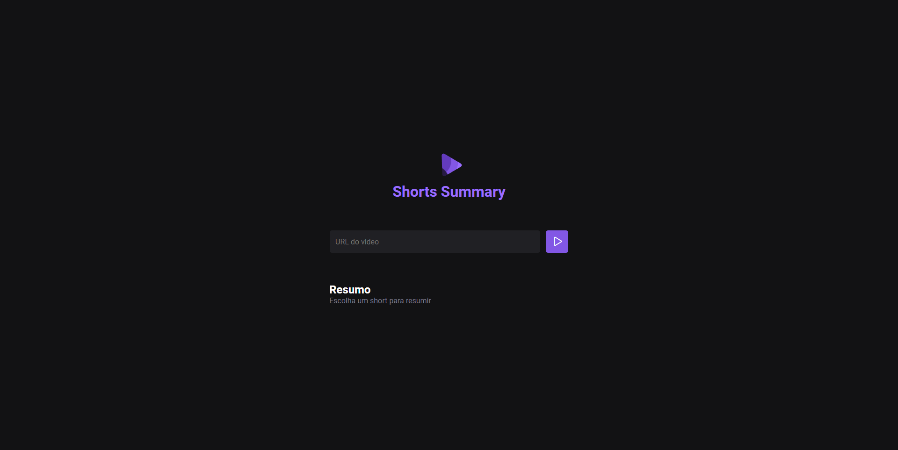

<div align="center">
  
  <h1 style="color: #996DFF">Shorts Summary</h1>
</div>

<p align="center">
  <a href="#project">Project</a>&nbsp;&nbsp;&nbsp;|&nbsp;&nbsp;&nbsp;
  <a href="#-technologies">Technologies</a>&nbsp;&nbsp;&nbsp;|&nbsp;&nbsp;&nbsp;
  <a href="#-Getting started">Getting started</a>&nbsp;&nbsp;&nbsp;|&nbsp;&nbsp;&nbsp;
  <a href="#-layout">Layout</a>&nbsp;&nbsp;&nbsp;|&nbsp;&nbsp;&nbsp;
  <a href="#-license">License</a>
</p>

<br>

<p align="center">
  
</p>

<h1 align="center">
    
</h1>


## 💻 Projeto

Application to transcribe audio from a short video from YouTube using Artificial Intelligence to do that transcription!


## 🧪 Technologies

This project was developed using the following technologies:
 
- [HTML](https://developer.mozilla.org/pt-BR/docs/Web/HTML)
- [CSS](https://developer.mozilla.org/pt-BR/docs/Web/CSS)
- [Javascript](https://developer.mozilla.org/pt-BR/docs/Web/JavaScript)
- [Vite](https://viteconf.org/23/?utm_campaign=stackblitz-on-page&utm_source=web-app&utm_medium=nav-button)

## 🚀 Getting started

Clone the project and access the folder.

```bash
$ git clone https://github.com/MaykonRaphael/nlw-ia.git
$ cd nlw-ia
```

Follow the steps below:
```bash
# Install the dependencies
$ yarn install

# Install the dependencies
$ npm install

# Start the project
$ npm run web

#Start the server in other terminal
$ npm run server
```

## 🔖 Layout

You can view the project layout through the links below:

- [Layout](https://www.figma.com/file/oHGSbosQyyfGXwgT4xKJ5H/Shorts-Summary?type=design&mode=design&t=VlkwJ3CcBCqVHR7x-0) 

Remembering that you need to have a [Figma](http://figma.com/) account to access it.

## 📝 License

This project is licensed under the MIT License. See the [LICENSE](LICENSE.md) file for details.

---
<p align="center">
  Made by Maykon Raphael 👋
</p>